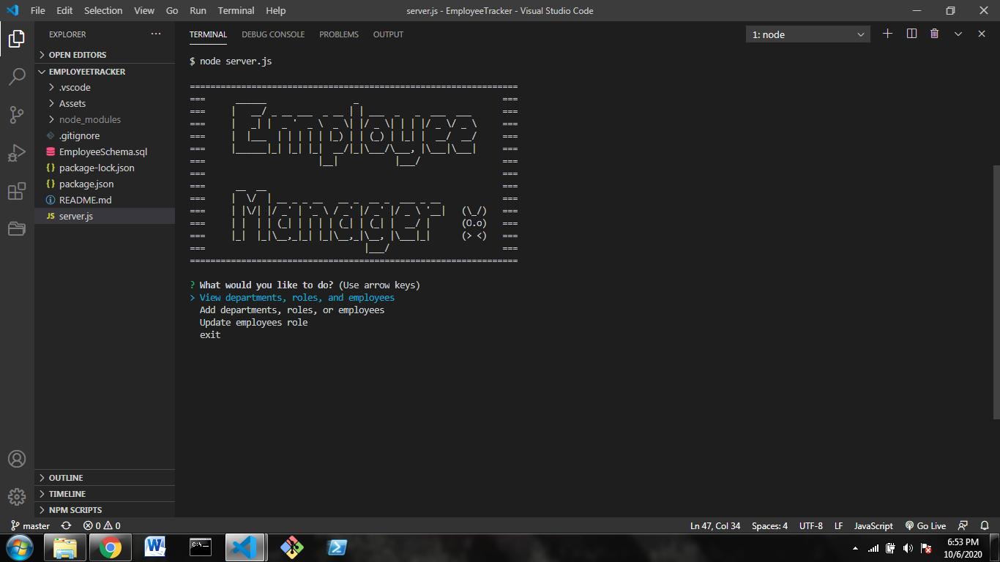

  # Employee Tracker

  

  ## Description
  * This application allows the user to view, add, update, delete different aspects of a company such as departments, jobs, and employees.

  ## Table of Contents
  * [Installation](#installation)
  * [Usage](#usage)
  * [License](#license)
  * [Contributing](#contributing)
  * [Tests](#tests)
  
  ## Installation
  * In order to start this Command Line Interface application, be sure to navigate to the server.js file under line 11 and put in your own mysql password!

  ## Usage
  * This application allows the user to use the CRUD method to create a business roster
  

  ## License
  * This project is licensed under: MIT

  ## Questions
  Please contact me with any questions you may have using the links below!
  * [GitHub Profile](https://github.com/haydenrust1)
  * <haydenrust1@gmail.com>
  